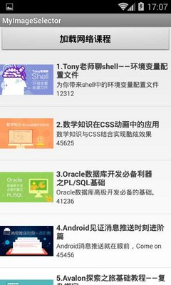
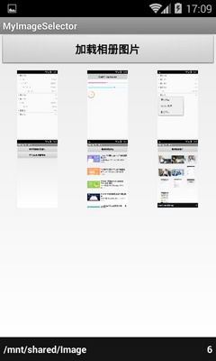
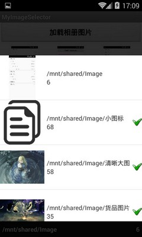

# AndroidImageSelector

## 项目介绍
这是一个自定义类似微信的图片选择器或相册的图片选择器，它可以加载大量的图片，然后供用户来选择，并保存用户所选择的图片信息。 
而图片的加载为异步加载，并设置了缓存机制。 
本demo中，核心类为ImageLoader.java，该类为为一个通用的图片异步加载类，可加载网络图片和本地图片，本地加载时可加载指定目录下的多级目录中的图片 
在加载本地图片时，还加入了ListView滑动过程中不加载的机制，只有滑动停止时，才加载ListView中可见的Item图片，以提高滑动的流畅度。 

### 效果图如下

主界面，2个入口而已 

 
网络图片加载界面 

 
本地图片加载界面，可加载指定目录下的多个图片目录 

